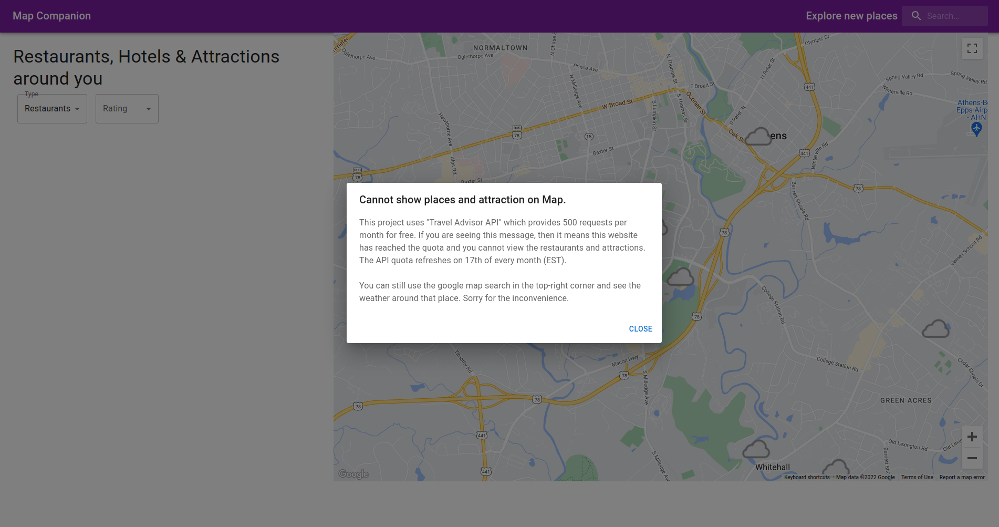
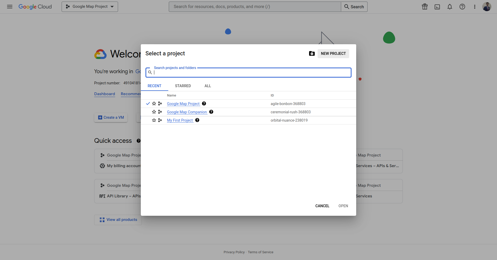
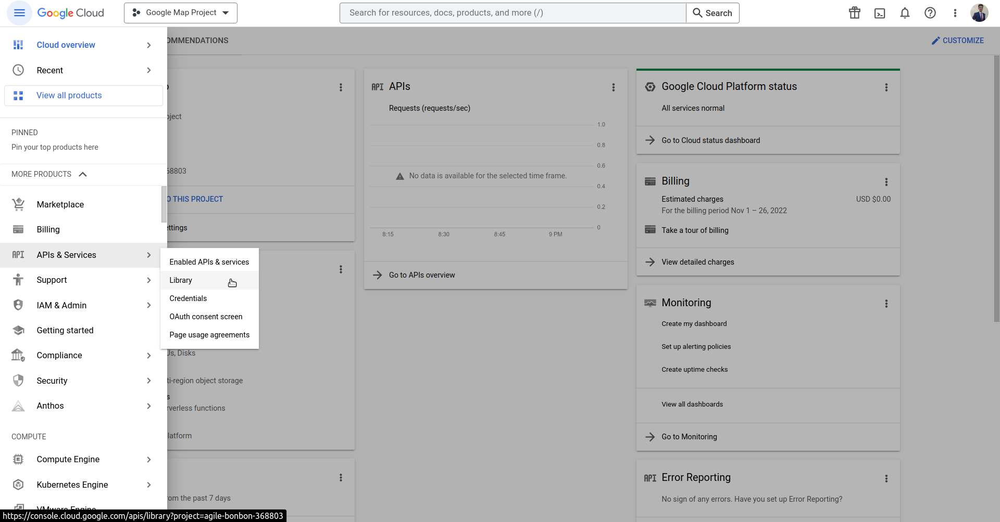

# Google Map Companion
[demo](https://kushaj-google-map.vercel.app/)


- Developed a Travel Companion Application utilizing Google Maps API, Geolocation, and advanced React/Next.js and TypeScript practices, leading to seamless user experience and efficient data handling. Also, gained proficiency in using Google Cloud Platform (GCP) for API setup and management.
- Used Material-UI for creating the interface and leveraged Travel Advisor API to fetch location-specific data on restaurants, hotels, and attractions for a highly personalized user experience, including filtering of locations based on ratings.
- Ensured app security and maintainability with environment variables, hooks, refs, and a well-organized folder structure, resulting in a highly scalable and deployable project on Vercel.

## Table of Contents
- [Demo Videos](#demo-videos)
    - [Desktop demo](#desktop-demo)
    - [Mobile demo](#mobile-demo)
    - [API not working demo](#api-not-working-demo)
- [Dependencies](#dependencies)
- [Local Setup](#local-setup)
    - [Node.js and repository setup](#nodejs-and-respository-setup)
    - [Travel Advisor API setup](#travel-advisor-api-setup)
    - [Weather API setup](#weather-api-setup)
    - [Google Maps Setup](#google-maps-setup)
- [License](#license)

## Demo Videos

### Desktop demo
- check the weather at different location
- search for the restaurants and attractions
- filter by ratings

https://user-images.githubusercontent.com/24699564/204117472-3becce24-960d-46a0-a69e-cbac87a48b09.mp4

### Mobile demo

https://user-images.githubusercontent.com/24699564/204117473-dc38c893-9cfd-444f-a09a-05564ab72d2b.mp4

### API not working demo
This project uses "Travel Advisor API" which provides 500 requests per month for free. If this happens, a dialog is shown giving more information about this and the user can still check the weather and search for places on the google maps.

https://user-images.githubusercontent.com/24699564/204117471-4424f4ea-c369-48cd-8a01-2d9db6940227.mp4

## Dependencies
- [React](https://reactjs.org/)
- [Next.js](https://nextjs.org/)
- [TypeScript](https://www.typescriptlang.org/)
- [MUI](https://mui.com/)
- [google-map-react](https://github.com/google-map-react/google-map-react)
- [@react-google-maps/api](https://react-google-maps-api-docs.netlify.app/)
- [Axios](https://axios-http.com/docs/intro)

## Local Setup

### Node.js and respository setup
**Step 1**. Setup Node.js v16.17.1. [nvm](https://github.com/nvm-sh/nvm) can be used to quickly setup Node.js (and you can also have multiple versions of Node.js).
```
curl -o- https://raw.githubusercontent.com/nvm-sh/nvm/v0.39.1/install.sh | bash
nvm install 16.17.1
```

**Step 2**. Clone the repository and install all the dependencies.
```
git clone https://github.com/KushajveerSingh/google_map_companion
cd google_map_companion
npm install --legacy-peer-deps
```

`--legacy-peer-deps` would install the exact packages as used in the repository. The repository already includes VSCode and Prettier setup, and you can modify the default behavior in `.vscode/settings.json` and `.prettierrc` respectively.

**Step 3**. Create `.env.local` and copy the contents from `.env.example` to `.env.local`.
- `NEXT_PUBLIC_BASE_URL` - set to `http://localhost:3000/` during development and when you deploy the project on Vercel, set it to the domain where the project is hosted.

### Travel Advisor API setup
**Step 1**. Goto [RapidAPI](https://rapidapi.com/hub) and create an account if not already.

**Step 2**. Goto [Travel Advisor](https://rapidapi.com/apidojo/api/travel-advisor) API and click **Subscribe to Test** and this would generate the API key for you.

**Step 3**. Copy the **X-RapidAPI-Key** key to `.env.local` under `NEXT_PUBLIC_TRAVEL_ADVISOR_KEY`.

Some tips when working with the API
- On the free tier only 500 requests are allowed per month. So for devlopment, I would suggest to create a secondary account on RapidAPI and use that instead.
- Because the request limit is low, I have added a Dialog box that pops up when a user visits the site and the request limit is reached. A screenshot of how the dialog box looks is attached below.
- Even when the limit is reached, you can still search for places and check the weather.



### Weather API setup

**Step 1**. Similar to above, goto [WeatherAPI.com](https://rapidapi.com/weatherapi/api/weatherapi-com) and click **Subscribe to Test**.

**Step 2**. Copy the **X-RapidAPI-Key** key to `.env.local` under `NEXT_PUBLIC_WEATHER_API_KEY`. If you are using the same account for both Travel Advisor and Weather API, then the keys would be same.

To show the weather, 5 random positions (plus the center) are chosen on the map. The logic for it is in `src/api.ts` and you can change the limit or the logic of getting the random places.

### Google Maps Setup

Note some things
- You will be setting up an account on [Google Cloud Platform](https://cloud.google.com/) and for that you need to provide credit card information.
- For this project, we do not have to setup any cloud instances and thus there would be no charges related to that.
- Google Maps provide a free montly quota, and if you go over that you will have to pay for that (you will not be autocharged). I still have $0 in billing.
- I have perosnlly set up a $5 alert on my account in case I ever get charged.

**Step 1**. Goto [Google Cloud Platform](https://cloud.google.com/) and create an account. Provide the bank information and claim the free joining credits.

**Step 2**. Goto Console -> New Project and provide all the necessary details. Select the billing associated with your credit card, that you setup in Step 1.



**Step 3**. On the left-hand sidebar of your project, click **APIs & Services** -> **Library**.



**Step 4**. Search for **Maps JavaScript API** and enable it. After enabling it, click on **Manage**.

**Step 5**. On the left-hand sidebar, click **Credentials** and then **Create Credentials** in the top.

**Step 6**. Copy the API key to `.env.local` under `NEXT_PUBLIC_GOOGLE_MAP_API_KEY`.

A video demo of the above is shown below.

https://user-images.githubusercontent.com/24699564/204116954-4e37a274-6639-4160-8086-3ca8d6ab2d8a.mp4

### Development and deployment instructions
**Step 1**. Run `npm run dev` to start the local development server at `localhost:3000`. Now you can customize the application as per your needs.

**Step 2**. After making the desired changes, you can push your project to GitHub and you are ready for deployment on [Vercel](https://vercel.com/)

**Step 3**. Create an account on [Vercel](https://vercel.com/) and then click **Add New...** -> **Project** and choose your github repository.

And that is it. You have successfully deployed your custom google map companion website to Vercel.

## License
This application has Apache License Version 2.0, as found in the [LICENSE](./LICENSE) file.
